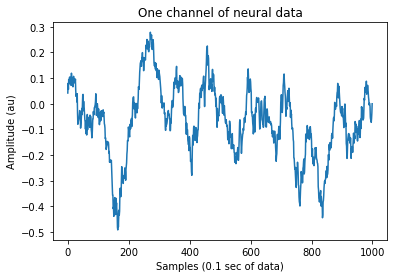
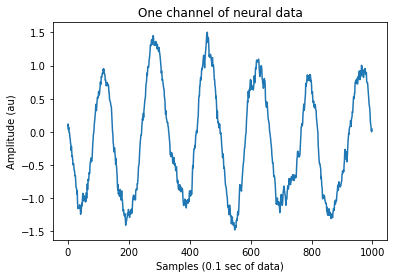
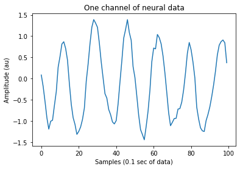
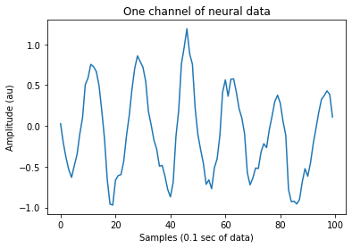
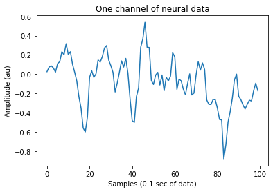
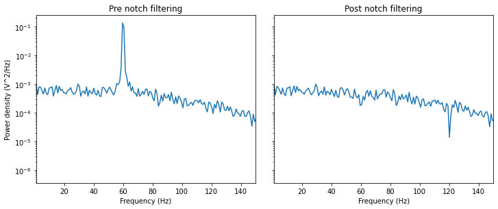
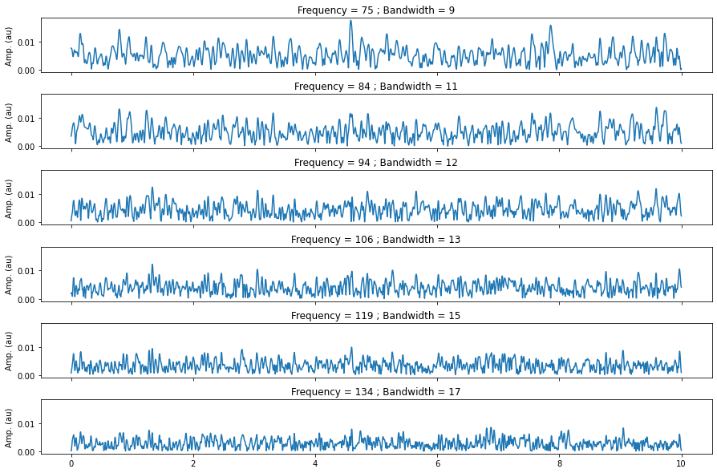
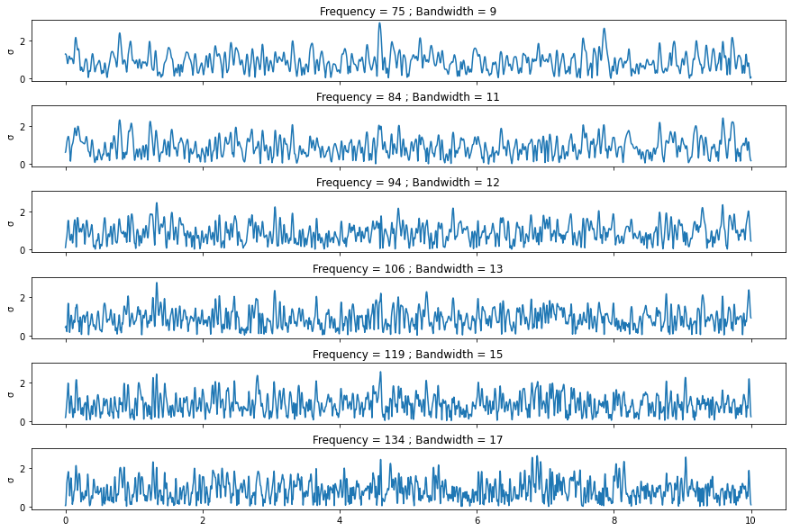

ECoG preprocessing tutorial
===========================

Bouchard Lab

Overview of steps
^^^^^^^^^^^^^^^^^

-  Resampling
-  Re-referencing
-  Notch filtering
-  Time-frequency power calculation
-  Normalizing power for each frequency

Some preliminaries
------------------

**Repo**: https://github.com/BouchardLab/process_nwb

-  ``process_nwb`` is a python package for preprocessing ECoG data.
-  The latest verison of this package can be found on github and
   documention can be found at readthedocs
-  This package is designed to take in nwb. For simplicity, I will just
   illustrate how the “core” functionality works without using NWB

Package imports
~~~~~~~~~~~~~~~

.. code:: ipython3

    import process_nwb as ecog
    import numpy as np
    import matplotlib.pyplot as plt

Create synthetic neural data
~~~~~~~~~~~~~~~~~~~~~~~~~~~~

-  Synthetic neural data is created by by convolving white noise with a
   boxcar
-  Common line noise (60Hz) is added but with different weights to each
   channel

.. code:: ipython3

    num_channels = 4
    duration = 10 #seconds
    sample_rate = 10000 #hz
    kernel_length = 50
    snr = 2.
    np.random.seed(0)
    line_noise_freq = 60. #hz
    
    #Create synthetic neural data by convolving white noise with a boxcar
    signal_data = np.random.randn(duration*sample_rate, num_channels)
    kernel = np.ones(kernel_length)/kernel_length
    
    for ch in range(num_channels):
        signal_data[:,ch] = np.convolve(signal_data[:,ch], kernel, mode='same')
        
    #Add common noise but with different weights to each channel
    t = np.linspace(0, duration, duration*sample_rate)
    line_noise = np.sin(2*np.pi*t*line_noise_freq).reshape(-1, 1)
    line_noise = np.repeat(line_noise, 4, axis=1)
    neural_data = snr*signal_data + line_noise@np.diag(np.random.randn(4))
    
    #Here is one channel of the pure neural data (signal only)
    plt.plot(signal_data[:1000,0])
    plt.xlabel('Samples (0.1 sec of data)')
    plt.ylabel('Amplitude (au)')
    plt.title('One channel of neural data')

.. parsed-literal::

    Text(0.5, 1.0, 'One channel of neural data')

.. code:: ipython3

    np.diag(np.random.randn(4))

.. parsed-literal::

    array([[-1.11066951,  0.        ,  0.        ,  0.        ],
           [ 0.        ,  1.77423104,  0.        ,  0.        ],
           [ 0.        ,  0.        ,  0.47994921,  0.        ],
           [ 0.        ,  0.        ,  0.        , -1.4904829 ]])

.. code:: ipython3

    #Here's signal + noise
    plt.plot(neural_data[:1000,0])
    plt.xlabel('Samples (0.1 sec of data)')
    plt.ylabel('Amplitude (au)')
    plt.title('One channel of neural data')

.. parsed-literal::

    Text(0.5, 1.0, 'One channel of neural data')

Resampling in the frequency domain
----------------------------------

-  Resample the data down to make computations much faster downstream
-  The resampling algorithm is done in the frequency domain

.. code:: ipython3

    from process_nwb import resample

.. code:: ipython3

    new_sample_rate = 1000 #hz
    rs_data = resample.resample(neural_data, new_sample_rate, sample_rate, real=True, axis=0)
    
    plt.plot(rs_data[:100,0])
    plt.xlabel('Samples (0.1 sec of data)')
    plt.ylabel('Amplitude (au)')
    plt.title('One channel of neural data')

.. parsed-literal::

    Text(0.5, 1.0, 'One channel of neural data')

Re-referencing with common average referencing
----------------------------------------------

-  Often times there is common noise from neural recording such as
   movement artifact or line noise
-  To remove, a robust estimate of the average across all signals (for
   each timepoint) is calculated than subtracted all channels

.. code:: ipython3

    car_data = ecog.common_referencing.subtract_CAR(rs_data, mean_frac=.95, round_func=np.ceil)
    
    plt.plot(car_data[:100,0])
    plt.xlabel('Samples (0.1 sec of data)')
    plt.ylabel('Amplitude (au)')
    plt.title('One channel of neural data')

.. parsed-literal::

    Text(0.5, 1.0, 'One channel of neural data')

Notch filtering
---------------

-  Since line noise is not of equal strength across channels, CAR fails
   at getting rid of all line noise.
-  Therefore, notch filtering is used to remove line noise on all
   channels

.. code:: ipython3

    nth_data = ecog.linenoise_notch.apply_linenoise_notch(car_data, new_sample_rate, fft=True)
    
    plt.plot(nth_data[:100,0])
    plt.xlabel('Samples (0.1 sec of data)')
    plt.ylabel('Amplitude (au)')
    plt.title('One channel of neural data')

.. parsed-literal::

    Text(0.5, 1.0, 'One channel of neural data')

.. code:: ipython3

    from scipy.signal import welch
    from scipy.signal.windows import kaiser

.. code:: ipython3

    window = kaiser(1024, 2)
    freq, car_pwr = welch(car_data[:,0], fs=new_sample_rate, window=window)
    _, nth_pwr = welch(nth_data[:,0], fs=new_sample_rate, window=window)
    
    fig, axs = plt.subplots(1,2, figsize=(10,4), sharey=True, sharex=True)
    fig.tight_layout()
    axs[0].semilogy(freq, car_pwr)
    axs[0].set_xlabel('Frequency (Hz)')
    axs[0].set_ylabel('Power density (V^2/Hz)')
    axs[0].set_xlim([1, 150])
    axs[0].set_title('Pre notch filtering')
    
    axs[1].semilogy(freq, nth_pwr)
    axs[1].set_xlabel('Frequency (Hz)')
    axs[1].set_xlim([1, 150])
    axs[1].set_title('Post notch filtering')

.. parsed-literal::

    Text(0.5, 1.0, 'Post notch filtering')

Time-frequency decomposition with wavelets
------------------------------------------

-  Here we decompose the neural time series into 6 different frequency
   bands using a wavelet transform
-  The wavelet transform outputs the analytical amplitude, which is
   complex valued.
-  I’m plotting the magnitude of analytical amplitude which is a proxy
   of band power

.. code:: ipython3

    from process_nwb import wavelet_transform

.. code:: ipython3

    tf_data, _, ctr_freq, bw = wavelet_transform.wavelet_transform(nth_data, new_sample_rate, filters='rat', hg_only=True, X_fft_h=None, npad=None)

.. code:: ipython3

    ctr_freq[:]

.. parsed-literal::

    array([ 75.00038179,  84.18506431,  94.49451968, 106.06648962,
           119.05558394, 133.63534627])

.. code:: ipython3

    tf_data.shape

.. parsed-literal::

    (10000, 4, 6)

.. code:: ipython3

    num_tf_signals = len(ctr_freq)
    fig, axs = plt.subplots(num_tf_signals, 1, sharex=True, sharey=True, figsize=(15,10))
    fig.subplots_adjust(hspace=0.4)
    fig.tight_layout
    
    time = np.linspace(0, duration, tf_data.shape[0])
    for idx in range(num_tf_signals):
        sig = np.abs(tf_data[:,0,idx])
        axs[idx].plot(time, sig)
        axs[idx].set_title('Frequency = {0:.0f} ; Bandwidth = {1:0.0f}'.format(ctr_freq[idx], bw[idx]))
        axs[idx].set_ylabel('Amp. (au)')

Normalizing power by z-scoring
------------------------------

-  For neural data, power falls off with frequency so it can be
   difficult to compare amplitude changes across different frequency
   bands.
-  To address this issue we normalize each frequency band by zscoring.
-  In this case, the mean and standard deviation are calculated over the
   entire signal, but if there’s a baseline period(s) then it would make
   more sense to calculate mean and standard deviation over those
   period(s)

.. code:: ipython3

    def zscore_signal(signal, mean=None, std=None):
        if mean is None:
            mean = np.mean(signal)
        if std is None:
            std = np.std(signal)
        return (signal - mean)/std

.. code:: ipython3

    tf_norm_data = np.empty(tf_data.shape, dtype='complex')
    
    for idx in range(num_tf_signals):
        for ch in range(num_channels):
            tf_norm_data[:,ch,idx] = zscore_signal(tf_data[:,ch,idx])

.. code:: ipython3

    num_tf_signals = len(ctr_freq)
    fig, axs = plt.subplots(num_tf_signals, 1, sharex=True, sharey=True,figsize=(15,10))
    fig.subplots_adjust(hspace=0.4)
    fig.tight_layout
    
    time = np.linspace(0, duration, tf_data.shape[0])
    for idx in range(num_tf_signals):
        sig = np.abs(tf_norm_data[:,0,idx])
        axs[idx].plot(time, sig)
        axs[idx].set_title('Frequency = {0:.0f} ; Bandwidth = {1:0.0f}'.format(ctr_freq[idx], bw[idx]))
        axs[idx].set_ylabel('σ')

Congrats you now know how to preprocess ECoG signals!
-----------------------------------------------------
